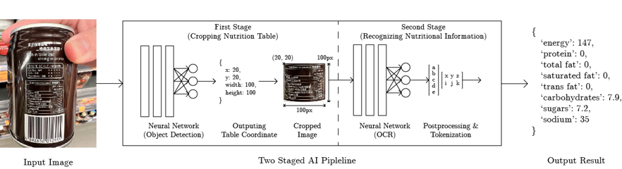
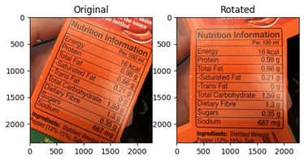
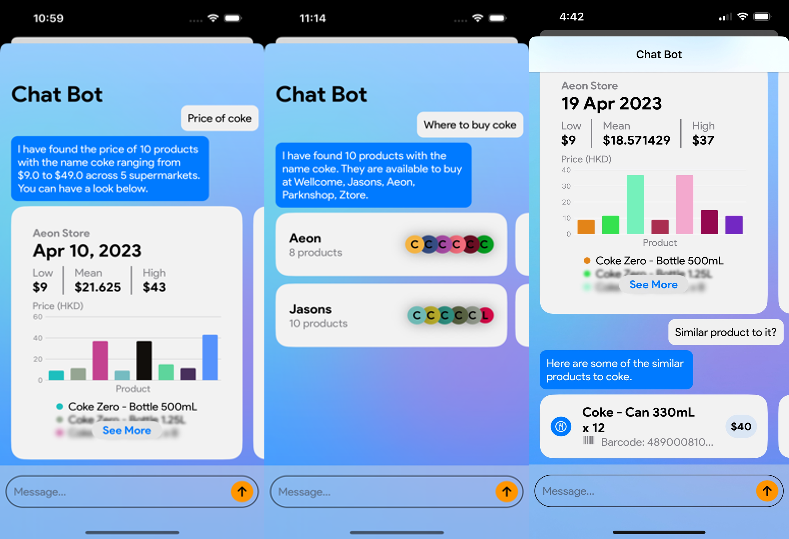

# FoodDietAssistanceFYP

The Final Year Project proposes a machine learning powered food diet assistance mobile application. The application extracts nutrition information from nutritional tables, suggests local food products through a chatbot, and furnishes users with detailed product information obtained from Hong Kong Government API. A backend server has been exploited for storing the massive amount of product records, handling heavy data flow, and supporting the chatbot model inference.

Our mobile application provides users with a comprehensive and effortless experience for accessing nutritional information and promoting healthy dietary choices and overall wellness.

## About the Project

---

The project is divided into 2 parts: [Frontend](https://github.com/skymoderator/FYP_FoodAssistantAPP) and [Backend](https://github.com/eltonm1/AI-Diet-Assistance-App-Backend).

The frontend only consists of the iOS mobile application. It is developed using Swift and Xcode. The frontend is responsible for the following tasks:

- Perform First Stage Model Inference (extracting nutritional information from nutritional tables)
- Perform API calls to the backend server to retrieve product information
- UI Interface for product information display, query, chatbot, product list (Inventory) modification, etc.

The backend consists of the following components:

- A Django server for handling API calls from the frontend
- A PostgreSQL database for storing product information
- An AI Inference Server for performing Second Stage Model Inference (tabulate nutritional information from cropped nutritional table images, which is the output of the First Stage Model)
- A Flask server for perform daily cron job (fetching product information from Hong Kong Government API and updating the database)

## Model Pipeline

---

The pipeline consists of 2 stages of model inference.

1. The First Stage Model is responsible for extracting nutritional information from nutritional tables.
2. The Second Stage Model is responsible for tabulating nutritional information from cropped nutritional table images, which is the output of the First Stage Model.

The first stage is deployed on app to provide real-time inference. The second stage is deployed on a server due to its heavy computational cost and multiple libraries dependencies.

### First Stage Model

The First Stage Model is a [YOLOv4 model](./PyTorch%20Yolov4/) with [custom synthetic nutrition table dataset](./FYP_SyntheticImage/). The dataset mimic the real-life nutritional tables in Hong Kong by simulating the following factors:

- Different fonts and font sizes
- Different color (with primary color being black)
- Different table layouts (e.g. 2 rows/columns headers)
- Different table styles (e.g. with/without borders)
- Different table contents (e.g. random numbers, random words, random Chinese characters, etc.)
- Different apperances (e.g. random background, random fold/flip, random rotation, etc.)

The model detects the bounding boxes of the nutritional tables and crops the images.

The cropping is handled on the app side by leveraging UIKit and CoreML.

The cropped images are then fed into the Second Stage Model for tabulating nutritional information.

### Second Stage Model

The second stage model consists of two sub-models:

1. A custom Nutrition Text Detection [YOLOv4](./NTTextYoloV4/) for detecting texts in the cropped nutritional table images
2. A custom [Four-Stage Scene Text Recognition (STR) framework](./LabelExtraction_SecondStage/) proposed by Jeonghun Baek, which further constitutes
   1. transformation
   2. feature extraction
   3. sequence modeling
   4. prediction, for text recognition.

Note that the YOLO in the second stage is different from that in First Stage, though they share the same architectures.

Similar to the First Stage Model, synthetic data is generated to train the YOLO model. The synthetic data is generated by randomly placing texts on the nutritional table images. The texts are randomly generated by randomly selecting words from a dictionary. The dictionary is constructed by extracting words from the nutritional table images in the First Stage Dataset.

To enhance the performance of text recognition, a technique is utilized to align the text horizontally by rotating the image. The process begins by converting the image to grayscale, followed by implementing canny edge detection. The algorithm then identifies line segments in a binary image through the probabilistic Hough transform. The first line's angle is determined using the arctan function, and the image is rotated by that angle utilizing affine transformation.

The model detects the bounding boxes of the texts and pair nutrition texts with their corresponding values. The model then performs text recognition on the nutrition texts and outputs the nutritional information in key-value format, where key is the nutrition name and value is the nutrition value.

## Product Database

Our database will consolidate nutrition information and price data for packaged food products in Hong Kong. The schema demonstrates the brief structure of the database. The main data object is the food products table. Each product links to many product price entries (to represent prices on different days and in different supermarkets) and a nutrition information entry.

## Chatbot

A chatbot is a powerful tool that can assist users in accessing food product information efficiently. It is also an ideal tool to offer food product recommendations to users in a questions-answering communication manner. To accurately answer users’ queries, we have classified six types (intent) of questions, namely

1. Product Price
2. Product Details
3. Where To Buy
4. Similar Products
5. Greeting
6. Unknown.

Each intent corresponds to a different aspect of product information. Named Entity Recognition (NER) have been used to identify and extract time and product information from the users’ queries. The model will be deployed on our Backend server. The inference server will communicate with the Django server for fetching queried product(s) information and prices.

## Mobile Application

The mobile application is developed using Swift and Xcode. The application consists of four main views:

1. Product List View: Displaying the list of products that users have added to their inventory. Users can add, delete, and modify the products in the inventory. Users can also search for products by name and barcode.

2. Camera View: Users can take a photo of the nutritional table of a food product. The app will perform First Stage Model Inference to extract the nutritional table from the photo. The app will then perform Second Stage Model Inference to extract the nutritional information from the nutritional table. The app will then display the nutritional information to the users. Users can also add the product to their inventory.

3. Chatbot View: Users can ask questions about food products to the chatbot. The chatbot will answer the questions by fetching information from the database. Users can also ask for product recommendations from the chatbot.

4. Inventory View: Users can view the nutritional information of the products in their inventory (list of products). The list is customizable by users. While user appends product on the list, the app will suggest similar products to the users.
